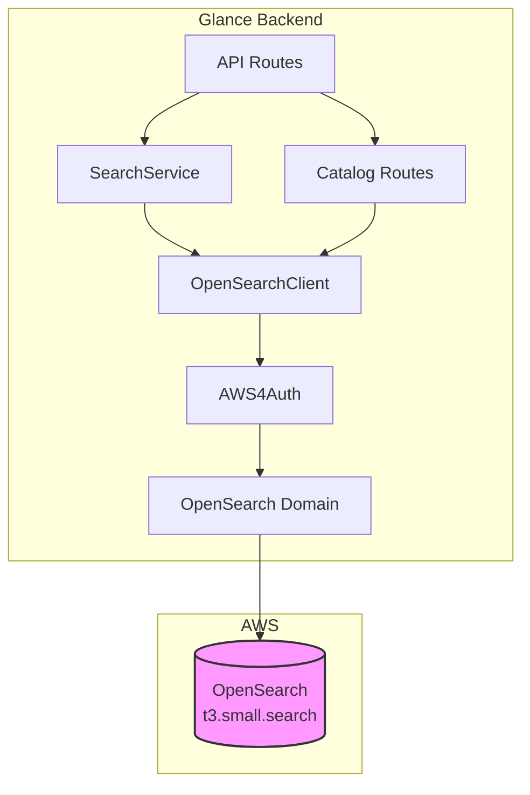
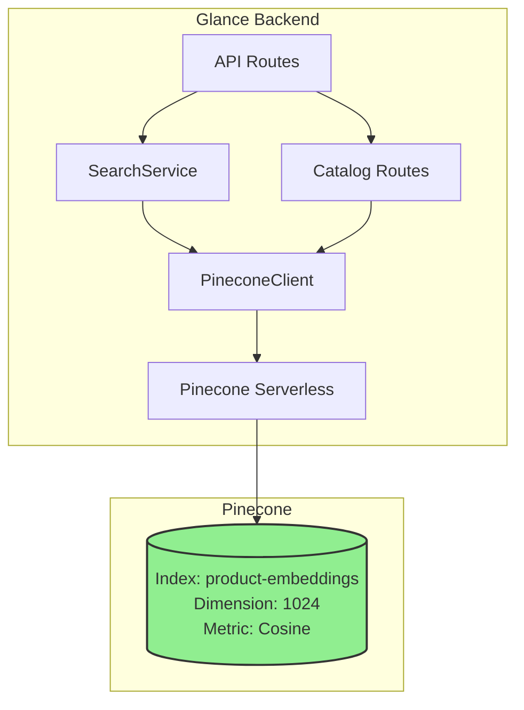

# OpenSearch to Pinecone Migration Plan

## Executive Summary

This document provides a comprehensive migration plan to replace Amazon OpenSearch with Pinecone for vector storage and retrieval in the Glance backend. The migration maintains all existing functionality including dual embedding search (text + image) and RRF merging.

**Migration Complexity:** Medium  
**Estimated Effort:** 2-3 development days  
**Risk Level:** Low (Pinecone has simpler API than OpenSearch)

---

## Table of Contents

1. [Architecture Comparison](#1-architecture-comparison)
2. [Current State Analysis](#2-current-state-analysis)
3. [Pinecone Data Model Design](#3-pinecone-data-model-design)
4. [File-by-File Migration Plan](#4-file-by-file-migration-plan)
5. [Implementation Checklist](#5-implementation-checklist)
6. [Risk Assessment & Mitigation](#6-risk-assessment--mitigation)
7. [Testing Strategy](#7-testing-strategy)
8. [Rollback Plan](#8-rollback-plan)

---

## 1. Architecture Comparison

### 1.1 OpenSearch vs Pinecone Feature Comparison

| Feature | OpenSearch (Current) | Pinecone (Target) | Notes |
|---------|---------------------|-------------------|-------|
| **Deployment Model** | AWS Managed Service | Serverless SaaS | Pinecone simpler ops |
| **Authentication** | AWS4Auth (IAM signing) | API Key | Pinecone much simpler |
| **k-NN Algorithm** | HNSW (NMSLib) | Proprietary (likely HNSW) | Both approximate similarity |
| **Distance Metric** | Cosine | Cosine | Same metric |
| **Dimensions** | 1024 | 1024 | Same |
| **Metadata Storage** | Yes (document fields) | Yes (up to 40KB per vector) | Pinecone has limits |
| **Filtering** | Rich query DSL | Metadata filtering only | Pinecone more limited |
| **RRF Support** | External (custom code) | External (custom code) | No change |
| **Index Management** | Manual index creation | Auto-created on first upsert | Pinecone simpler |
| **Scaling** | Manual instance sizing | Auto-scaling | Pinecone advantage |
| **Pricing Model** | Per instance hour | Per query + storage | Need to evaluate |

### 1.2 Architecture Diagrams

#### Current OpenSearch Architecture



#### Target Pinecone Architecture



### 1.3 Data Flow Comparison

#### OpenSearch Flow (Current)
```
Query Text → Nova Embedding → OpenSearch k-NN Query → Two Field Searches → RRF Merge → Results
                                      ↓
                                text_embedding field
                                image_embedding field
```

#### Pinecone Flow (Target)
```
Query Text → Nova Embedding → Pinecone Query → Two Namespace Queries → RRF Merge → Results
                                      ↓
                                text-embeddings namespace
                                image-embeddings namespace
```

---

## 2. Current State Analysis

### 2.1 Files Referencing OpenSearch

| File | Purpose | Lines Referencing OpenSearch | Migration Action |
|------|---------|------------------------------|------------------|
| [`app/db/opensearch_client.py`](app/db/opensearch_client.py:1) | Main client implementation | All 360 lines | **DELETE + REPLACE** with pinecone_client.py |
| [`app/services/search_service.py`](app/services/search_service.py:9) | Search with RRF merging | 3 imports + 4 usages | **MODIFY** - Update client reference |
| [`app/api/routes/health.py`](app/api/routes/health.py:9) | Health check endpoint | 2 imports + 6 lines | **MODIFY** - Update health check |
| [`app/api/routes/catalog.py`](app/api/routes/catalog.py:11) | Catalog ingestion | 1 import + 4 lines | **MODIFY** - Update client reference |
| [`app/db/__init__.py`](app/db/__init__.py:4) | DB exports | 1 import + 1 export | **MODIFY** - Update exports |
| [`app/config.py`](app/config.py:42) | Configuration | 7 config vars + 1 property | **MODIFY** - Replace with Pinecone config |
| [`app/core/exceptions.py`](app/core/exceptions.py:34) | Custom exceptions | 1 exception class | **MODIFY** - Rename to VectorDBException |
| [`app/core/constants.py`](app/core/constants.py:49) | Constants | 4 OpenSearch constants | **MODIFY** - Update or remove |
| [`app/core/__init__.py`](app/core/__init__.py:7) | Exception exports | 1 export | **MODIFY** - Update export |
| [`scripts/init_opensearch.py`](scripts/init_opensearch.py:1) | Index initialization | All 36 lines | **DELETE + REPLACE** with init_pinecone.py |
| [`requirements.txt`](requirements.txt:15) | Dependencies | 2 packages | **MODIFY** - Remove opensearch-py, add pinecone |
| **Documentation Files** |  |  |  |
| [`requirements.md`](requirements.md:114) | Requirements doc | Multiple sections | **UPDATE** - Replace OpenSearch references |
| [`plan.md`](plan.md:38) | Implementation plan | Multiple sections | **UPDATE** - Replace OpenSearch references |
| [`setup.md`](setup.md:157) | Setup guide | Multiple sections | **UPDATE** - Replace with Pinecone setup |
| [`flow.md`](flow.md:61) | Data flow doc | Multiple sections | **UPDATE** - Replace with Pinecone flow |
| [`.env.example`](.env.example:61) | Environment template | 8 variables | **MODIFY** - Replace with Pinecone vars |

### 2.2 Current OpenSearch Schema

```json
{
  "product_id": "string (keyword)",
  "store_id": "string (keyword)",
  "embedding_type": "string (keyword)",
  "text_embedding": "knn_vector[1024] (cosine, HNSW)",
  "image_embedding": "knn_vector[1024] (cosine, HNSW)",
  "combined_text": "text",
  "metadata": {
    "category": "keyword",
    "price": "float",
    "color": "keyword"
  },
  "created_at": "date"
}
```

### 2.3 Current OpenSearch Operations

| Operation | Current Method | Usage Count | Pinecone Equivalent |
|-----------|---------------|-------------|---------------------|
| Index Creation | `create_index()` | 1 (init script) | Auto-created on upsert |
| Store Vector | `index_embedding()` | 1 | `index.upsert()` |
| Text Search | `search_by_text_embedding()` | 1 | `index.query()` with text namespace |
| Image Search | `search_by_image_embedding()` | 1 | `index.query()` with image namespace |
| Delete Vector | `delete_by_product_id()` | 0 (not used) | `index.delete()` |
| Health Check | `health_check()` | 1 | `client.describe_index()` |

---

## 3. Pinecone Data Model Design

### 3.1 Namespace Strategy

**Recommended Approach: Two Namespaces**

Pinecone uses namespaces to logically separate vectors within an index. This is ideal for our dual embedding use case.

```
Index: product-embeddings
├── Namespace: "text-embeddings"
│   └── Vectors with text_embedding as values
└── Namespace: "image-embeddings"
    └── Vectors with image_embedding as values
```

**Rationale:**
- Allows querying text and image embeddings separately
- Maintains same search semantics as OpenSearch dual-field approach
- Simpler than storing both embeddings in single record metadata

### 3.2 Vector Record Structure

```json
{
  "id": "{product_id}",
  "values": [1024-dimensional vector],
  "metadata": {
    "product_id": "prod_12345",
    "store_id": "store_67890",
    "combined_text": "Blue linen summer shirt casual lightweight breathable",
    "category": "shirts",
    "price": 59.99,
    "color": "blue",
    "created_at": "2026-03-05T16:40:47Z"
  }
}
```

### 3.3 Query Patterns

#### Text Similarity Search
```python
index.query(
    namespace="text-embeddings",
    vector=query_embedding,
    top_k=10,
    filter={"store_id": {"$eq": "store_67890"}}
)
```

#### Image Similarity Search
```python
index.query(
    namespace="image-embeddings",
    vector=query_embedding,
    top_k=10,
    filter={"store_id": {"$eq": "store_67890"}}
)
```

---

## 4. File-by-File Migration Plan

### 4.1 CREATE: [`app/db/pinecone_client.py`](app/db/pinecone_client.py:1) (NEW)

**Purpose:** Replace OpenSearchClient with PineconeClient

**Key Methods to Implement:**

```python
class PineconeClient:
    """Client for Pinecone vector database operations."""
    
    def __init__(self):
        # Initialize Pinecone with API key
        
    def _get_index(self):
        # Get or create index reference
        
    def upsert_vector(
        self,
        product_id: str,
        store_id: str,
        text_embedding: list,
        image_embedding: list,
        combined_text: str,
        metadata: dict = None
    ) -> bool:
        # Upsert to both namespaces
        
    def search_by_text_embedding(
        self,
        embedding: list,
        k: int = 10,
        store_id: str = None
    ) -> list:
        # Query text-embeddings namespace
        
    def search_by_image_embedding(
        self,
        embedding: list,
        k: int = 10,
        store_id: str = None
    ) -> list:
        # Query image-embeddings namespace
        
    def delete_by_product_id(self, product_id: str) -> bool:
        # Delete from both namespaces
        
    def health_check(self) -> bool:
        # Check Pinecone connectivity
```

**Implementation Notes:**
- Use `pinecone>=6.0.0` (latest stable)
- Handle both namespaces in upsert/delete operations
- Map Pinecone results to same format as OpenSearch for compatibility

### 4.2 MODIFY: [`app/config.py`](app/config.py:1)

**Changes Required:**

```python
# REMOVE these OpenSearch settings:
OPENSEARCH_HOST: str = "localhost"
OPENSEARCH_PORT: int = 9200
OPENSEARCH_USE_SSL: bool = False
OPENSEARCH_VERIFY_CERTS: bool = False
OPENSEARCH_INDEX: str = "product_embeddings"
OPENSEARCH_AWS_REGION: str = "us-east-1"

# ADD these Pinecone settings:
PINECONE_API_KEY: str = ""  # Required
PINECONE_INDEX_NAME: str = "product-embeddings"
PINECONE_CLOUD: str = "aws"  # Serverless provider
PINECONE_REGION: str = "us-east-1"
```

**Update property:**
```python
# REMOVE:
@property
def opensearch_url(self) -> str: ...

# ADD (optional):
@property
def pinecone_index_full_name(self) -> str: ...
```

### 4.3 MODIFY: [`app/services/search_service.py`](app/services/search_service.py:1)

**Changes Required:**

```python
# Line 9: CHANGE import
# FROM:
from app.db.opensearch_client import get_opensearch_client
# TO:
from app.db.pinecone_client import get_pinecone_client

# Line 22: CHANGE initialization
# FROM:
self.opensearch = get_opensearch_client()
# TO:
self.pinecone = get_pinecone_client()

# Lines 60-71: Update method calls (interface stays same)
# FROM:
text_results_raw = self.opensearch.search_by_text_embedding(...)
image_results_raw = self.opensearch.search_by_image_embedding(...)
# TO:
text_results_raw = self.pinecone.search_by_text_embedding(...)
image_results_raw = self.pinecone.search_by_image_embedding(...)
```

### 4.4 MODIFY: [`app/api/routes/health.py`](app/api/routes/health.py:1)

**Changes Required:**

```python
# Lines 7-9: CHANGE imports
# FROM:
from app.core.exceptions import DatabaseException, OpenSearchException
from app.db.opensearch_client import get_opensearch_client
# TO:
from app.core.exceptions import DatabaseException, VectorDBException
from app.db.pinecone_client import get_pinecone_client

# Lines 42-51: Update health check
# FROM:
opensearch = get_opensearch_client()
os_healthy = opensearch.health_check()
services_status["opensearch"] = "connected" if os_healthy else "disconnected"
# TO:
pinecone = get_pinecone_client()
pc_healthy = pinecone.health_check()
services_status["vector_db"] = "connected" if pc_healthy else "disconnected"

# Line 66: Update critical service check
# FROM:
if services_status["database"] == "error" or services_status["opensearch"] == "error":
# TO:
if services_status["database"] == "error" or services_status["vector_db"] == "error":
```

### 4.5 MODIFY: [`app/api/routes/catalog.py`](app/api/routes/catalog.py:1)

**Changes Required:**

```python
# Line 11: CHANGE import
# FROM:
from app.db.opensearch_client import get_opensearch_client
# TO:
from app.db.pinecone_client import get_pinecone_client

# Line 89: CHANGE client reference
# FROM:
opensearch = get_opensearch_client()
opensearch.index_embedding(...)
# TO:
pinecone = get_pinecone_client()
pinecone.upsert_vector(...)
```

### 4.6 MODIFY: [`app/db/__init__.py`](app/db/__init__.py:1)

**Changes Required:**

```python
# Lines 3-6: CHANGE exports
# FROM:
from app.db.rds_client import get_rds_client, init_db
from app.db.opensearch_client import get_opensearch_client
__all__ = ["get_rds_client", "init_db", "get_opensearch_client"]
# TO:
from app.db.rds_client import get_rds_client, init_db
from app.db.pinecone_client import get_pinecone_client
__all__ = ["get_rds_client", "init_db", "get_pinecone_client"]
```

### 4.7 MODIFY: [`app/core/exceptions.py`](app/core/exceptions.py:34)

**Changes Required:**

```python
# Lines 34-38: RENAME exception
# FROM:
class OpenSearchException(GlanceException):
    """Exception for OpenSearch operations."""
    def __init__(self, message: str = "OpenSearch error"):
        super().__init__(message, status_code=503)

# TO:
class VectorDBException(GlanceException):
    """Exception for vector database operations."""
    def __init__(self, message: str = "Vector database error"):
        super().__init__(message, status_code=503)

# Keep OpenSearchException as alias for backward compatibility (optional):
OpenSearchException = VectorDBException  # deprecated alias
```

### 4.8 MODIFY: [`app/core/__init__.py`](app/core/__init__.py:1)

**Changes Required:**

```python
# Lines 6-7, 16-17: UPDATE exports
# FROM:
from app.core.exceptions import (
    DatabaseException,
    OpenSearchException,
    ...
)
__all__ = [
    "DatabaseException",
    "OpenSearchException",
    ...
]

# TO:
from app.core.exceptions import (
    DatabaseException,
    VectorDBException,
    OpenSearchException,  # keep for backward compat
    ...
)
__all__ = [
    "DatabaseException",
    "VectorDBException",
    "OpenSearchException",  # deprecated alias
    ...
]
```

### 4.9 MODIFY: [`app/core/constants.py`](app/core/constants.py:49)

**Changes Required:**

```python
# Lines 48-52: UPDATE constants
# FROM:
# OpenSearch
OPENSEARCH_DEFAULT_KNN_K = 10
OPENSEARCH_EF_SEARCH = 100
OPENSEARCH_EF_CONSTRUCTION = 128
OPENSEARCH_M = 24

# TO:
# Vector Database (Pinecone)
VECTOR_DB_DEFAULT_TOP_K = 10
# Remove OpenSearch-specific HNSW parameters (not needed for Pinecone)
```

### 4.10 MODIFY: [`.env.example`](.env.example:61)

**Changes Required:**

```bash
# REMOVE OpenSearch section:
# ============================================
# OPENSEARCH CONFIGURATION
# ============================================
OPENSEARCH_HOST=localhost
OPENSEARCH_PORT=9200
OPENSEARCH_USE_SSL=false
OPENSEARCH_VERIFY_CERTS=false
OPENSEARCH_INDEX=product_embeddings
OPENSEARCH_AWS_REGION=us-east-1

# ADD Pinecone section:
# ============================================
# PINECONE CONFIGURATION
# ============================================
# Pinecone API key (get from console.pinecone.io)
PINECONE_API_KEY=your-pinecone-api-key-here

# Pinecone index name
PINECONE_INDEX_NAME=product-embeddings

# Pinecone serverless cloud provider (aws or gcp)
PINECONE_CLOUD=aws

# Pinecone region (should match AWS region)
PINECONE_REGION=us-east-1
```

### 4.11 MODIFY: [`requirements.txt`](requirements.txt:1)

**Changes Required:**

```txt
# REMOVE:
opensearch-py==2.7.1
requests-aws4auth==1.3.1

# ADD:
pinecone>=6.0.0
```

### 4.12 CREATE: [`scripts/init_pinecone.py`](scripts/init_pinecone.py:1) (NEW)

**Purpose:** Initialize Pinecone index (optional, for explicit control)

```python
#!/usr/bin/env python3
"""Initialize Pinecone index."""

import sys
import os

sys.path.insert(0, os.path.dirname(os.path.dirname(os.path.abspath(__file__))))

from pinecone import Pinecone, ServerlessSpec
from app.config import get_settings
from app.core.logging import configure_logging, get_logger

configure_logging()
logger = get_logger(__name__)


def main():
    """Initialize Pinecone index."""
    settings = get_settings()
    
    logger.info("initializing_pinecone")
    
    try:
        pc = Pinecone(api_key=settings.PINECONE_API_KEY)
        
        # Check if index exists
        index_name = settings.PINECONE_INDEX_NAME
        existing_indexes = pc.list_indexes()
        
        if index_name in existing_indexes.names():
            logger.info("pinecone_index_already_exists", index=index_name)
            print(f"ℹ️ Pinecone index '{index_name}' already exists.")
            return
        
        # Create index
        pc.create_index(
            name=index_name,
            dimension=settings.EMBEDDING_DIMENSIONS,  # 1024
            metric="cosine",
            spec=ServerlessSpec(
                cloud=settings.PINECONE_CLOUD,  # "aws"
                region=settings.PINECONE_REGION  # "us-east-1"
            )
        )
        
        logger.info("pinecone_index_created", index=index_name)
        print(f"✅ Pinecone index '{index_name}' created successfully!")
        
    except Exception as e:
        logger.error("pinecone_initialization_failed", error=str(e))
        print(f"❌ Pinecone initialization failed: {e}")
        sys.exit(1)


if __name__ == "__main__":
    main()
```

### 4.13 DELETE: [`app/db/opensearch_client.py`](app/db/opensearch_client.py:1)

**Action:** Delete entire file after Pinecone client is working

**Migration Note:** Keep file until end of migration for reference

### 4.14 DELETE: [`scripts/init_opensearch.py`](scripts/init_opensearch.py:1)

**Action:** Delete entire file after Pinecone init script is created

---

## 5. Implementation Checklist

### Phase 1: Setup & Dependencies

- [ ] Create `pinecone_client.py` with full implementation
- [ ] Update `requirements.txt` - remove opensearch-py, add pinecone
- [ ] Update `.env.example` with Pinecone variables
- [ ] Update `config.py` with Pinecone settings
- [ ] Create `init_pinecone.py` script
- [ ] Install new dependencies: `pip install pinecone>=6.0.0`

### Phase 2: Code Migration

- [ ] Update `search_service.py` - change client reference
- [ ] Update `catalog.py` - change client reference
- [ ] Update `health.py` - change health check
- [ ] Update `db/__init__.py` - update exports
- [ ] Rename `OpenSearchException` to `VectorDBException` in `exceptions.py`
- [ ] Update `core/__init__.py` - update exports
- [ ] Update `constants.py` - remove OpenSearch-specific constants

### Phase 3: Documentation Updates

- [ ] Update `requirements.md` - replace OpenSearch with Pinecone
- [ ] Update `plan.md` - update architecture diagrams
- [ ] Update `setup.md` - replace setup instructions
- [ ] Update `flow.md` - update data flow descriptions
- [ ] Update `README.md` - if it references OpenSearch

### Phase 4: Cleanup

- [ ] Delete `opensearch_client.py`
- [ ] Delete `init_opensearch.py`
- [ ] Verify no remaining OpenSearch references: `grep -r "opensearch\|OpenSearch" --include="*.py" .`
- [ ] Update `.gitignore` if any OpenSearch-specific entries

### Phase 5: Testing

- [ ] Run `init_pinecone.py` to create index
- [ ] Test catalog ingestion endpoint
- [ ] Test search endpoint
- [ ] Test health check endpoint
- [ ] Verify RRF merging works correctly
- [ ] Performance test search queries
- [ ] Verify metadata filtering works

---

## 6. Risk Assessment & Mitigation

| Risk | Likelihood | Impact | Mitigation |
|------|------------|--------|------------|
| **Pinecone API changes** | Low | Medium | Pin to major version: `pinecone>=6.0.0,<7.0.0` |
| **Metadata size limits** | Medium | High | Validate metadata < 40KB per vector; compress if needed |
| **Query performance degradation** | Low | High | Benchmark before/after; Pinecone typically faster |
| **Data migration issues** | Low | High | Re-index from RDS if needed; embeddings can be regenerated |
| **Filter compatibility** | Medium | Medium | Test all filter patterns; Pinecone has different filter syntax |
| **Namespace query overhead** | Low | Low | Two queries is same as OpenSearch dual-field approach |
| **Cost increase** | Medium | Medium | Monitor usage; Pinecone pricing different from OpenSearch |

### 6.1 Pinecone-Specific Considerations

1. **Metadata Limits:** Pinecone allows up to 40KB metadata per vector. Current metadata is small (~500 bytes), well within limits.

2. **Filter Syntax:** Pinecone uses MongoDB-style query operators:
   - `{"$eq": "value"}` for equality
   - `{"$in": ["a", "b"]}` for list membership
   - `{"$gte": 10, "$lte": 100}` for ranges

3. **Serverless vs Pod-based:** Using serverless for cost efficiency. No capacity planning needed.

4. **No Transaction Support:** Upserts are atomic per vector. If text upsert succeeds and image fails, we'll have inconsistent state. **Mitigation:** Wrap in retry logic; inconsistency acceptable for search use case.

---

## 7. Testing Strategy

### 7.1 Unit Tests

Test each method in `PineconeClient`:
- `upsert_vector()` - verify both namespaces updated
- `search_by_text_embedding()` - verify correct namespace queried
- `search_by_image_embedding()` - verify correct namespace queried
- `delete_by_product_id()` - verify deletion from both namespaces
- `health_check()` - verify connectivity check

### 7.2 Integration Tests

Test end-to-end flows:
1. Catalog ingestion → Vector storage → Search retrieval
2. Verify RRF scores are calculated correctly
3. Verify metadata filters work (store_id filtering)
4. Verify match types are determined correctly

### 7.3 Performance Tests

Compare metrics before/after:
- Query latency (p50, p95, p99)
- Indexing throughput
- Search throughput

### 7.4 Test Commands

```bash
# Initialize Pinecone
python scripts/init_pinecone.py

# Test health
curl http://localhost:8000/health

# Test catalog ingestion
curl -X POST http://localhost:8000/ingest-catalog \
  -H "Content-Type: application/json" \
  -H "X-API-Key: your-api-key" \
  -d @test_catalog.json

# Test search
curl -X POST http://localhost:8000/search \
  -H "Content-Type: application/json" \
  -d '{"query": "blue linen shirt", "limit": 3}'
```

---

## 8. Rollback Plan

If migration issues occur:

### 8.1 Immediate Rollback

1. Revert code changes (git revert)
2. Restore OpenSearch client files from git history
3. Update environment variables back to OpenSearch
4. Restart application

### 8.2 Data Consistency

- RDS remains source of truth - no data loss
- If vectors were indexed to Pinecone but not OpenSearch, re-run catalog ingestion after rollback
- Embeddings can be regenerated from product data

### 8.3 Rollback Commands

```bash
# Revert last commit
git revert HEAD

# Or restore specific files
git checkout HEAD~1 -- app/db/opensearch_client.py
git checkout HEAD~1 -- scripts/init_opensearch.py

# Restore dependencies
pip install opensearch-py==2.7.1 requests-aws4auth==1.3.1
pip uninstall pinecone -y
```

---

## Appendix A: Pinecone Client Implementation Reference

```python
"""Pinecone client for vector storage and similarity search."""

from pinecone import Pinecone, ServerlessSpec
from app.config import get_settings
from app.core.exceptions import VectorDBException
from app.core.logging import get_logger

logger = get_logger(__name__)

TEXT_NAMESPACE = "text-embeddings"
IMAGE_NAMESPACE = "image-embeddings"


class PineconeClient:
    """Client for Pinecone vector database operations."""
    
    def __init__(self):
        self.settings = get_settings()
        self.client = Pinecone(api_key=self.settings.PINECONE_API_KEY)
        self.index_name = self.settings.PINECONE_INDEX_NAME
        self._index = None
    
    def _get_index(self):
        """Lazy load index reference."""
        if self._index is None:
            self._index = self.client.Index(self.index_name)
        return self._index
    
    def upsert_vector(self, product_id, store_id, text_embedding, 
                      image_embedding, combined_text, metadata=None) -> bool:
        """Upsert product embeddings to both namespaces."""
        index = self._get_index()
        base_metadata = {
            "product_id": product_id,
            "store_id": store_id,
            "combined_text": combined_text,
            **(metadata or {})
        }
        
        # Upsert to text namespace
        index.upsert(
            namespace=TEXT_NAMESPACE,
            vectors=[{
                "id": product_id,
                "values": text_embedding,
                "metadata": base_metadata
            }]
        )
        
        # Upsert to image namespace
        index.upsert(
            namespace=IMAGE_NAMESPACE,
            vectors=[{
                "id": product_id,
                "values": image_embedding,
                "metadata": base_metadata
            }]
        )
        
        return True
    
    def search_by_text_embedding(self, embedding, k=10, store_id=None):
        """Search text embeddings namespace."""
        return self._search_namespace(TEXT_NAMESPACE, embedding, k, store_id)
    
    def search_by_image_embedding(self, embedding, k=10, store_id=None):
        """Search image embeddings namespace."""
        return self._search_namespace(IMAGE_NAMESPACE, embedding, k, store_id)
    
    def _search_namespace(self, namespace, embedding, k, store_id):
        """Execute search on specific namespace."""
        index = self._get_index()
        
        filter_dict = {}
        if store_id:
            filter_dict["store_id"] = {"$eq": store_id}
        
        response = index.query(
            namespace=namespace,
            vector=embedding,
            top_k=k,
            filter=filter_dict if filter_dict else None,
            include_metadata=True
        )
        
        return [{
            "product_id": match.metadata["product_id"],
            "score": match.score,
            "source": match.metadata
        } for match in response.matches]
    
    def health_check(self) -> bool:
        """Check Pinecone connectivity."""
        try:
            stats = self._get_index().describe_index_stats()
            return stats is not None
        except Exception as e:
            logger.error("pinecone_health_check_failed", error=str(e))
            return False


_pinecone_client = None

def get_pinecone_client():
    """Get singleton Pinecone client."""
    global _pinecone_client
    if _pinecone_client is None:
        _pinecone_client = PineconeClient()
    return _pinecone_client
```

---

## Appendix B: Environment Variable Migration

| Old Variable | New Variable | Notes |
|--------------|--------------|-------|
| `OPENSEARCH_HOST` | `PINECONE_API_KEY` | No equivalent; use API key |
| `OPENSEARCH_PORT` | - | Not needed |
| `OPENSEARCH_USE_SSL` | - | Always HTTPS |
| `OPENSEARCH_VERIFY_CERTS` | - | Always verified |
| `OPENSEARCH_INDEX` | `PINECONE_INDEX_NAME` | Direct equivalent |
| `OPENSEARCH_AWS_REGION` | `PINECONE_REGION` | Should match AWS region |
| - | `PINECONE_CLOUD` | New: "aws" or "gcp" |

---

## Summary

This migration replaces Amazon OpenSearch with Pinecone while maintaining full functional parity:

1. **Dual embedding storage** → Two namespaces in Pinecone
2. **Dual k-NN search** → Two namespace queries
3. **RRF merging** → Unchanged (same algorithm)
4. **Metadata storage** → Pinecone metadata (within limits)
5. **Health checks** → Pinecone index stats

**Key Benefits of Migration:**
- Simpler authentication (API key vs AWS signing)
- Serverless auto-scaling
- Potentially lower operational overhead
- Modern vector-native API

**Next Steps:**
1. Review this plan with stakeholders
2. Set up Pinecone account and get API key
3. Begin Phase 1 implementation
4. Run integration tests
5. Deploy to staging for validation
6. Production deployment with monitoring
